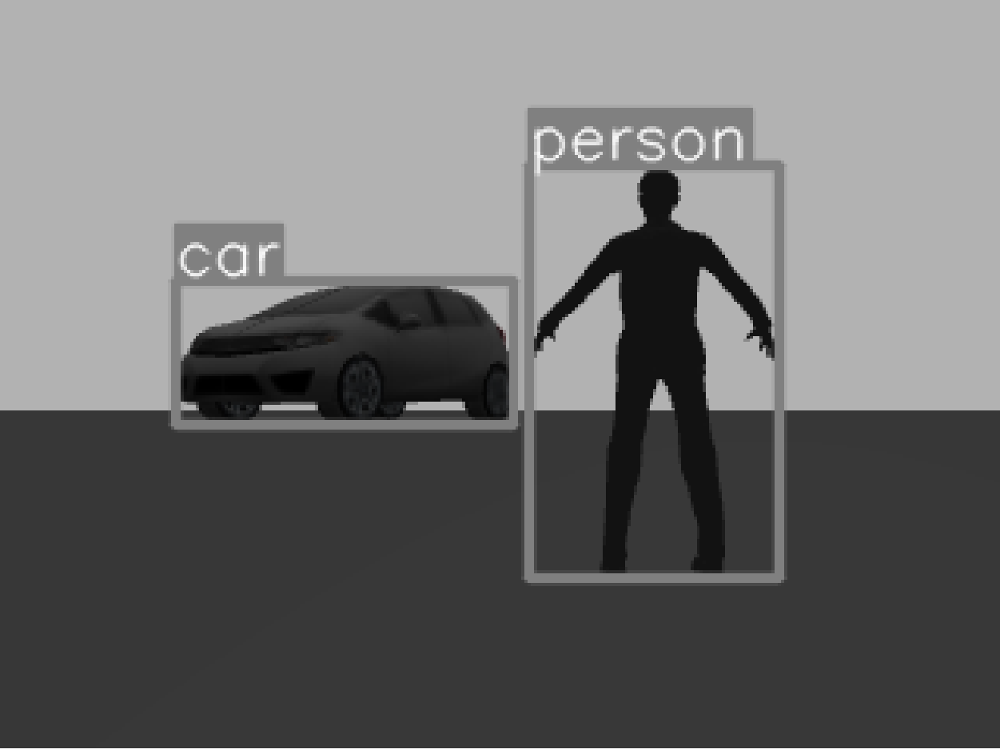

<!--# Kogrob HW Object Tracking-->
<!--Homework for Cognitive Robotics (BMEGEMINMKR) subject of BME/BUTE-->
# Kognitív robotika 
## Object Tracking házi feladat - 2024 tavasz


<!--https://github.com/HorvathBenedek/Kogrob_HW_Tracking/blob/main/media/NVIDIA_Overlay_W6DkVaR8zW.mp4-->

<!--<a href="https://www.youtube.com/watch?v=uLRQJh-y9AU"></a>-->

<!--<a href="https://github.com/HorvathBenedek/Kogrob_HW_Tracking/tree/main/media/NVIDIA_Overlay_W6DkVaR8zW.mp4"></a>-

<!--<video src="https://github.com/rayytsn9/ROBOTT/assets/79029536/62f541aa-aa8c-43f5-9ead-4b7a2e0d7c2a" width="300" />-->

<!--<video src="https://github.com/HorvathBenedek/Kogrob_HW_Tracking/tree/main/media/NVIDIA_Overlay_W6DkVaR8zW.mp4" width="800" />-->

## Tartalomjegyzék
1. [A feladat leírása](#A-feladat-leírása)  
2. [Megvalósítás](#Megvalósítás)
2.1 [A Gazebo szimuláció felépítése](#A-Gazebo-szimuláció-felépítése)
2.2 [A robot viselkedésének áttekintése](#A-robot-viselkedésének-áttekintése)
2.3 [A kód magyarázata](#A-kód-magyarázata)
3. [Telepítés](#Telepítés)
3.1 [Környezet létrehozása](#Környezet-létrehozása)
3.2 [A repo klónozása](#A-repo-klónozása)

## A feladat leírása
A választott feladatunk témája emberek vagy tárgyak felismerése és követése klasszikus
vagy neurális hálós algoritmusos képfeldolgozás segítségével TurtleBot3 Burger roboton, 
vagy szimulált ROS/Gazebo környezetben annak virtuális másán ROS segítségéve. 
Mi az utóbbit választottuk. 
Ennek megfelelően a konkrét feladat 
- a megfelelő Gazebo világ elkészítése, illetve
- azon belül a TurtleBot3 Burger robot irányítására olyan program vagy programok írása,
- amely a környezetben felismer egy adott típusú objektumot, és
- kifejezetten a felismert objektumot képes követni, tehát távolságot tartani, 
és a kamerát az objektumon tartani. 

## Megvalósítás

A programot a `kogrob_tracking.launch` file futtatásával indíthatjuk, ez tartalmazza a szükséges komponenseket. 

### A Gazebo szimuláció felépítése

A szimuláció a `Small_City.world` Gazebo világban fut.
```xml
  <include file="$(find gazebo_ros)/launch/empty_world.launch">
    <arg name="world_name" value="$(find kogrob_tracking)/launch/Small_City.world"/>
    <arg name="paused" value="false"/>
    <arg name="use_sim_time" value="true"/>
    <arg name="gui" value="true"/>
    <arg name="headless" value="false"/>
    <arg name="debug" value="false"/>
  </include>
```
Tartalmaz a szimuláció továbbá két TurtleBot3 irányítású modellt. Az egyik értelemszerűen a robotunk; a 
másik egy kézzel irányítható emberfigura. Ezzel demonstrálható, hogy a program sikeresen végzi a követési
feladatot. 

```xml
  <param name="robot_description" command="$(find xacro)/xacro --inorder $(find kogrob_tracking)/urdf/turtlebot3_human.urdf.xacro" />
  <node pkg="gazebo_ros" type="spawn_model" name="spawn_urdf" args="-urdf -model turtlebot3_human -x $(arg x_pos) -y $(arg y_pos) -z $(arg z_pos) -param robot_description" />
  
  <group ns = "follower">
    <param name="robot_description" command="$(find xacro)/xacro --inorder $(find kogrob_tracking)/urdf/turtlebot3_burger_for_autorace.urdf.xacro" />
    <node pkg="gazebo_ros" type="spawn_model" name="spawn_urdf" args="-urdf -model follower_turtlebot3_burger -x $(arg follower_x_pos) -y $(arg follower_y_pos) -z $(arg  follower_z_pos) -param /follower/robot_description" />
  </group>
```
A robot viselkedését a `controller.py` és `image_processor.py` kódok határozzák meg, melyik
a `../kogrob_tracking/src` mappában találhatók. 


Ezek a programok párhuzamosan futnak; a `Controller` felelős a robot mozgatásáért, míg az `ImageProcessor` a
YOLOv5 algoritmus segítségével dolgozza fel a kamerából bejövő jelet. 

### A robot viselkedésének áttekintése

A robot viselkedését az alábbi gráffal lehet szemléltetni


Lényegében a robot viselkedése két szálon fut - a fent említett `controller.py` és `image_processor.py`
fájlokban definiált `Controller` és `ImageProcessor` osztályok. 
- Az `ImageProcessor` a Gazebo szimuláció kamera objektumának képét veszi, ezt eltárolja a `self.image_np`-ben
- Eközben a `Controller` érzékelési request-et küld az `ImageProcessor`-nak.
- Az `ImageProcessor` a requestet feldolgozandó az eltárolt kameraképet beküldi a YOLOv5 neurális hálós
szegmentálási és osztályozási algoritmusba. 
- Az `ImageProcessor` visszaküldi a beazonosított objektumok közül a legvalószínűbb helyét és méretét.
- A `Controller` ennek megfelelően igazítja a sebességét és szögsebességét
- Végül pedig a `Controller` a Gazebo szimulációnak `Twist` üzenet formájában elküldi az elvárt mozgási és 
forgási sebességeket. 

### A kód magyarázata

_Megjegyzés: A robot működését vezérlő kód bemutatásánál a lényegretörőség érdekében csak a fontosabb részleteket emelnénk 
ki. A kivágott kódrészletek helyét `##[...]` komment jelöli._

A rospy node-ok és az osztályok inicializálása után a osztályt a `Controller.run()` függvénnyel indíthatjuk el 
az osztályok együttes működését. Az  `ImageProcessor` osztálynak nincs `run()` függvénye, helyette az `update_view()` 
függvénye van, ami automatikusan hívódik amíg a `rospy` fut; feladata a kamera képének bekérése és eltárolása, 
erről később lesz szó. 
```python
##controller.py
if __name__ == "__main__":
    rospy.init_node("controller", anonymous=True)
    controller = Controller()
    controller.run()

##image_processor.py
if __name__ == "__main__":
    rospy.init_node("image_processor", anonymous=True)
    rospy.on_shutdown(cv2.destroyAllWindows)
    image_processor = ImageProcessor()
    rospy.spin()
```

A `Controller()` osztály inicializáló függvénye:
```python
class Controller:
    def __init__(self) -> None:
        self.move = Twist()
        self.freeze = Twist()
        self.cmd_publisher = rospy.Publisher('/follower/cmd_vel', Twist, queue_size=100)
        ##[...]
        rospy.wait_for_service('detection')
        self.detection = rospy.ServiceProxy('detection', Detection)
```
Itt a főbb lépések
- létrehozunk egy publisher-t `cmd_vel` topichoz, ahova `Twist` üzeneteket fogunk küldeni, ezzel 
irányítjuk a robotot.
- Várunk an `ImageProcessor` osztályra, hogy létrehozzon egy `rospy.Service` kiszolgálót. Err 
- Továbbá létrehozunk egy `ServiceProxy`-t.

A  `rospy.Service` és  `rospy.ServiceProxy` használatáról lejjebb lesz szó. 

Az `ImageProcessor` osztály inicializáló függvénye:
```python
class ImageProcessor:
    def __init__(self) -> None:
        self.image_msg = Image() # Image message
        ##[...]
        self.camera_subscriber = rospy.Subscriber("/follower/camera/image", Image, callback=self.camera_listener)
        self.model: YOLO = YOLO('../yolo/yolov5nu.pt')
        self.results: Results = self.model(self.image_np)
        ##[...]
        self.human_detection_server = rospy.Service('detection', Detection, self.human_detection)
        ##[...]
        self.update_view()
```

**Itt a főbb lépések:**
- létrehozunk egy subscriber-t `follower/camera/image` topichoz, ez veszi a robot kamerájának
képét.
- A kép feldolgozását a YOLO modell fogja végezni, amit a `self.model()` függvénnyel hívhatunk meg.
- A `Controller` felé történő kommunikációra létrehozunk egy ropsy `Service`-t; ez fogja kiszolgálni a
`Controller` kérésseit. 
- végül pedig frissítjük a képet a `self.update_view()` függvénnyel; itt egy `rospy.Sunscriber`
segítésével vesszük a kamera adatait. 

> **A `rospy.Service()` és `rospy.ServiceProxy()` paradigma magyarázata:**
>
> Lényegében a `Service/ServiceProxy` pár ugyanazt a feladatot tölti be, mint a `Publisher/Subscriber` 
> pár, de megvalósításban és felhasználási területben eltérnek. 
> A `Publisher/Subscriber` node-ok folyamatosan küldenek és vesznek adatot, míg a `Service/ServiceProxy`
> node-ok esetén e `Service` ("adó", kb. kiszolgáló) a `ServiceProxy` ("vevő", vagy kliens) kérése nyomán 
> közvetít egy üzenetet a `Service`. Ezenfelül a `Service/ServiceProxy` kommunikációs pár blokkoló módban működik. 
> Minden azt jelenti, hogy a `Publisher/Subscriber` paradigma alkalmasabb folytonos adatfolyam
> közvetítésére visszaigazolás nélkül; míg a `Service/ServiceProxy` paradigma ideális háttérben futó 
> másodlagos számítások lekérdezéséhez; szinkron jellegéből adódóan jobban ütemezhető hosszabb számítási igényű 
> feladatok ellátására. 

A mi megvalósításunkban a `Controller` a fent említett `rospy.ServiceProxy('detection', Detection)` node segítségével 
ad le igényt az `ImageProcessor`-ban található `rospy.Service('detection', Detection, self.human_detection)` számára,
hogy szolgáltasson célpontot a kamera képének feldolgozása segítségével. 
```python
class Controller:
    def __init__(self) -> None:
        ##[...]
        rospy.wait_for_service('detection')
        self.detection = rospy.ServiceProxy('detection', Detection)
        ##[...]

    def run(self) -> None:
        try:
            while not rospy.is_shutdown():
                label = "person"
                response = self.detection(label)
                ##[...]


class ImageProcessor:
    def __init__(self) -> None:
        ##[...]
        self.human_detection_server = rospy.Service('detection', Detection, self.human_detection)
        ##[...]

    def human_detection(self, req):
        ##[...]
        res = DetectionResponse()
        ##[...]
        return res
```
Itt a `Detection` paraméter a `../kogrob_tracking/srv/Detection.srv` ROS szerverben definiált üzenet-formátum, 
a `self.human_detection` függvény pedig a service request lekezeléséért felelős függvény. Látható, hogy ennek
visszatérési paramétere `DetectionResponse()` formátumú. A fent említett `Detection.srv` tartalmazza a beérkező üzenet
és a visszaküldött válasz formátumát is, erre hivatkozik a `DetectionResponse()`. 

```python
##Detection.srv
string label
---
float64 box_x
float64 box_y
float64 box_width
float64 box_height
float64 image_width
float64 image_height
bool in_sight_of_robot
```
Látható, hogy a bemenő paraméter a label, vagyik a keresett objektumkategória; míg a visszakapott értékek 
a YOLOv5 által megtalált legideálisabb objektumnak, annak határoló téglalapjának paraméterei, illetve 
egy logikai érték, ami azt mutatja, hogy talált-e a keresettnek megfelelő objektumot. 

A programot összekötő elemek már ismertek, tekintsük át a tényleges algoritmus működését, elsősorban a 
`Controller.run()`, az `ImageProcessor.human_detection()` és az `ImageProcessor.update_view()` 
függvényekre tekintettel. 

**`ImageProcessor.update_view()`:**

```python
class ImageProcessor:
    ##[...]
    def update_view(self):
        try:
            while not rospy.is_shutdown():
                if len(self.image_msg.data) == 0:  # If there is no image data
                    continue

                # Convert binary image data to numpy array
                self.image_np = np.frombuffer(self.image_msg.data, dtype=np.uint8)
                self.image_np = self.image_np.reshape(self.image_res)

                # Update results
                self.results = self.model(self.image_np)

                # Draw object bounding boxes on frame
                frame = copy.deepcopy(self.image_np)
                annotator = Annotator(frame)

                for bbox in self.bounding_boxes:
                    cls, x1, y1, x2, y2 = bbox
                    color = (128, 128, 128)  # Gray color
                    annotator.box_label([x1, y1, x2, y2], label=self.model.names[cls], color=color)

                cv2.imshow("robot_view", cv2.cvtColor(frame, cv2.COLOR_RGB2BGR))
                cv2.waitKey(1)

        except rospy.exceptions.ROSInterruptException:
            pass
```
Látható, hogy az `update_view()` feladata 
- a kamera képének beolvasása,
- annak betáplálása a YOLOv5 neurális hálóba - `self.model(self.image_np)`, majd
- a kép ábrázolása a neurális háló által visszatérített hatázolónégyzetekkel és kategóriákkal együtt. 
Gyakorlatban ez az alábbi módon néz ki. 

<!---->

**`Controller.run()`**

```python
class Controller:
    ##[...]
    def run(self) -> None:
        try:
            while not rospy.is_shutdown():
                label = "person"
                response = self.detection(label)

                if response.in_sight_of_robot:
                    self.find_errors(response)
                    
                    # Angular velocity control
                    self.move.angular.z = self.angular_vel_coef * self.angular_error

                    # Linear velocity control
                    if self.distance_error < 0:
                        self.move.linear.x = self.linear_vel_coef * abs(self.distance_error)  # Move backward if too close
                    else:
                        self.move.linear.x = -self.linear_vel_coef * self.distance_error  # Move forward if too far

                    self.cmd_publisher.publish(self.move)
                else:
                    self.move.linear.x = 0  # Stop linear movement when target is lost
                    self.move.angular.z = 0.3  # Rotate to search for the target
                    self.cmd_publisher.publish(self.move)

        except rospy.exceptions.ROSInterruptException:
            pass
```

Ennek a függvénynek két fő funkciója van.
- Egyrészt, mint az már említésre került, kikéri a YOLOv5 modell által detektált objektumok közül a
keresettet (a `ImageProcessor.human_detection()` függvény visszatérési értékét). 
- Másrészt szabályozza a mozgási és forgási sebességet a kapott adatok alapján. A szabályozóalgoritmus 
feladata a kamera középvonalának rajtatartása a trackelt objektumon, továbbá az ideális távolság
megtartása az objektumtól, hiszen ha túl közel vagy távol kerül, a YOLO feldolgoza romlik. Az algoritmus az alábbi
logika alapján épül fel:
    1. A `Controller.find_error()` függvény segítségével a szabályozó szöghibájának kiszámítása a 
        kép ismert mérete és a detektált objektum határoló téglalapjának (dobozának) paramétereiból. Lényegében 
        a szöghiba értéke szöghiba = irány * |X<sub>doboz</sub> - X<sub>kép</sub>|, és irány ∈ {-1, 1}
    2. A távolság becslése az objektum látszólagos mérete alapján, és távolsági hiba számítása. A méret 
       becslése arányosításon alapul, szükséges hozzá az objektum hozzávetőleges mérete 1 méter távolságban.
       Ha a becslés megvan, kivonjuk belőle a biztonságos minimum követési távolságot. 
    3. A távolság és a szöghiba ismeretében meghatározzuk az X irányú (előre mutató sebességet és a
       Z tengely menti (vízszintes síkú) forgási szögsebességet.
          * Ha van célpont, ω<sub>Z</sub> és v<sub>X</sub> egy-egy P szabályzóval közelít a nyugalmi pont felé. 
          * Ha nincs célpont, a sebesség 0, a robot forog és keres.

**`ImageProcessor.human_detection()`**
```python
class ImageProcessor:
    def human_detection(self, req):
        self.bounding_boxes = []
        res = DetectionResponse()
        person_detected = False

        for result in self.results:
            boxes = result.boxes
            for box in boxes:
                cls = box.cls.item()
                x1, y1, x2, y2 = box.xyxy[0]
                self.bounding_boxes.append([cls, x1, y1, x2, y2])

                # Check if the detected object is a person
                label_box = self.model.names[cls]
                if label_box == "person":
                    person_detected = True
                    res.box_x = x1
                    res.box_y = y1
                    res.box_width = x2 - x1
                    res.box_height = y2 - y1
                    res.image_width = self.image_res[1]
                    res.image_height = self.image_res[0]
                    res.in_sight_of_robot = True

        # If a person is detected, return the detection response
        if person_detected:
            return res
        else:
            # If no person is detected, return response indicating not in sight
            return DetectionResponse(in_sight_of_robot=False)
```
Itt lényegében az `update_view()` által feljegyzett detektálási eredmények közül kiválasztjuk az 
elvárt kategóriának megfelelőt. Ha pedig nem találtunk megfelelőt, az `in_sight_of_robot` logikai értéket `False`-ra
állítjuk. 
Említésre érdemes, hogy jól látszanak a `DetectionResponse()` formátum elemei - `box_x, box_y, box_width`, stb. 
A program ebben a formában kifejezetten emberi alakok detektálására van kiélezve, ezt természetesen 
át lehet írni bármely a YOLOv5 által detektálni képes kategóriára minimális erőbefektetéssel.

## Telepítés

### Környezet létrehozása
A telepítés feltétele természetesen a ROS és Gazebo programok használata, amelyek valamilyen
Linux operációs rendszerhez kötöttek. Mi a programot WSL segítségével Ubuntu 20.04 alatt futtattuk,
tehát ezt javasoljuk használatra. A ROS Noetic telepítéséhez részletes leírást találni [itt](https://wiki.ros.org/noetic/Installation/Ubuntu)

Szükségünk lesz az ultralytics csomagra a YOLO algoritmushoz, amit felhasználtunk 
(egész pontosan YOLOv5). Ezt az alábbi paranccsal tudjuk telepíteni:
```bash
$ pip install ultralytics
```
További szükséges Python package-ek: 
- numpy: legalább 1.20.3-as verzió
- opencv legalább 4.2.0
Tehát:
```bash
$ pip install numpy==1.20.3
$ pip install opencv-python==4.2.0.34
```
Itt értelemszerűen magasabb verziószámmot választani lehet. 

### A repo klónozása
Lépjünk a tetszőleges Catkin Workspace-ünkbe, majd hozzunk létre egy kogrob_tracking rospy package-et.
```bash
$ cd ~/catkin_ws/src
$ catkin_create_pkg kogrob_tracking rospy
```
Klónozzuk a jelenlegi Github repository-t!
```bash
git clone https://github.com/HorvathBenedek/Kogrob_HW_Tracking.git
```
Majd helyezzük a tartalmát a létrehozott package-be úgy, hogy a package-en belül az
alábbi mappaszerkezetet kapjuk:
```bash
$ tree
├── CMakeLists.txt
├── README.md
├── launch
│   └── kogrob_tracking.launch
├── meshes
│   └── Human.001.stl
├── package.xml
├── src
│   ├── controller.py
│   └── image_processor.py
├── srv
│   └── Detection.srv
├── urdf
│   ├── turtlebot3_burger_for_autorace.gazebo.xacro
│   ├── turtlebot3_burger_for_autorace.urdf.xacro
│   └── turtlebot3_human.urdf.xacro
├── worlds
│   ├── Small_City.world
│   └── polyline.world
└── yolo
    └── yolov5nu.pt
```
A biztonság kedvéért futtasuk a catkin_make-et. 

Ezzel tulajdonképpen a program futtatásra kész. Futtatni az alábbi paranccsal tudjuk:
```bash
$ roslaunch kogrob_tracking kogrob_tracking.launch
```
Amennyiben hibába futunk bele, tegyük futtathatóvá a .py file-okat:
```bash
$ cd ~/catkin_ws/src/kogrob_tracking/src
$ chmod +x controller.py
$ chmod +x image_processor.py
```
<!--Illetve amennyiben szerkesztettük a .py file-okat, érdemes lefuttatni az alábbi parancsokat. 
Ezzek a .py file-okba kerülő esetleges 
```bash
$ 
$ dos2unix controller.py
$ dos2unix image_processor.py
```-->
